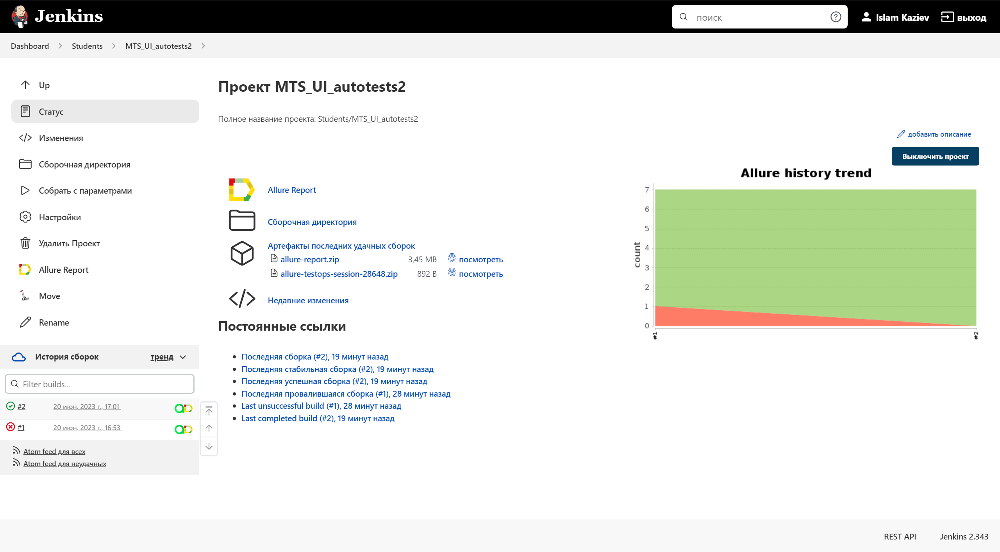
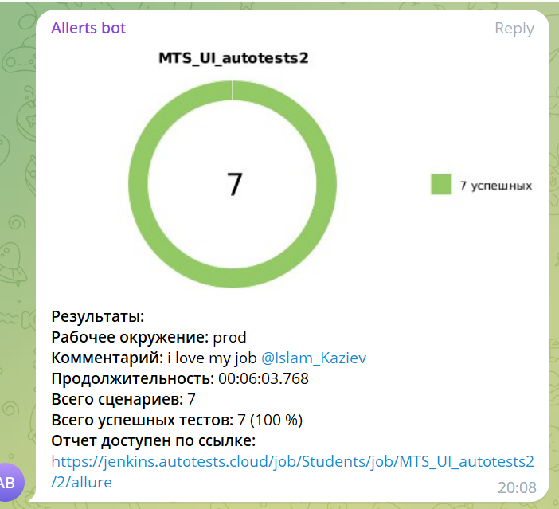

# Проект по автоматизации тестирования функционала возможности подключения тарифов на сайте MTС
## :pushpin: Содержание:

- [Использованный стек технологий](#computer-использованный-стек-технологий)
- [Запуск тестов](#running_woman-запуск-тестов)
- [Сборка в Jenkins](#-сборка-в-jenkins)
- [Пример Allure-отчета](#-пример-allure-отчета)
- [Уведомления в Telegram с использованием бота](#-уведомления-в-telegram-с-использованием-бота)
- [Видео примера запуска теста в Selenoid](#-видео-примера-запуска-теста-в-selenoid)

## :computer: Использованный стек технологий

<p align="center">


</p>

Автотесты написаны на <code>Java</code> с использованием <code>JUnit 5</code> и <code>Gradle</code>.
Для UI-тестов использован фреймворк [Selenide](https://selenide.org/).
Запуск тестов можно осуществлять локально или с помощью [Selenoid](https://aerokube.com/selenoid/).
Также реализована сборка в <code>Jenkins</code> с формированием Allure-отчета и отправкой уведомления с результатами в <code>Telegram</code> после завершения прогона.

Allure-отчет включает в себя:
* шаги выполнения тестов;
* скриншот страницы в браузере в момент окончания автотеста;
* Page Source;
* логи браузерной консоли;
* видео выполнения автотеста.

## :running_woman: Запуск тестов

### Локальный запуск тестов
```
gradle clean test -Denv=local
```

При необходимости можно переопределить параметры запуска
```
gradle clean test
-Denv=local
-Dbrowser=${BROWSER}
-DbrowserVersion=${BROWSER_VERSION}
-DbrowserSize=${BROWSER_SIZE}
-DbaseUrl=${BASE_URL}
```

### Запуск тестов на удаленном браузере
```
gradle clean test -Denv=remote
```
При необходимости также можно переопределить параметры запуска

```
gradle clean test -Denv=remote
-Dbrowser=${BROWSER}
-DbrowserМersion=${BROWSER_VERSION}
-DbrowserSize=${BROWSER_SIZE}
-DbaseUrl=${BASE_URL}
```

### Параметры сборки

* <code>BROWSER</code> – браузер, в котором будут выполняться тесты. По-умолчанию - <code>chrome</code>.
* <code>BROWSER_VERSION</code> – версия браузера, в которой будут выполняться тесты. По-умолчанию - <code>100.0</code>.
* <code>BROWSER_SIZE</code> – размер окна браузера, в котором будут выполняться тесты.
* <code>BASE_URL</code> – Url, по которому будет открываться тестируемое приложение. По-умолчанию - <code>https://spb.mts.ru</code>.

##  <a href="https://jenkins.autotests.cloud/job/Students/job/MTS_UI_autotests2/">Сборка в Jenkins</a>
<p align="center">

</p>

##   <a href="https://jenkins.autotests.cloud/job/Students/job/MTS_UI_autotests2/2/allure/">Пример Allure-отчета</a>
### Overview

<p align="center">

</p>

### <a href="https://allure.autotests.cloud/launch/25237">Результат выполнения теста</a>

<p align="center">

</p>

###  Уведомления в Telegram с использованием бота

После завершения сборки специальный бот, созданный в <code>Telegram</code>, автоматически обрабатывает и отправляет сообщение с отчетом о прогоне.

<p align="center">

</p>

###  Видео примера запуска теста в Selenoid

К каждому тесту в отчете прилагается видео. Одно из таких видео представлено ниже.
<p align="center">
  
</p>
